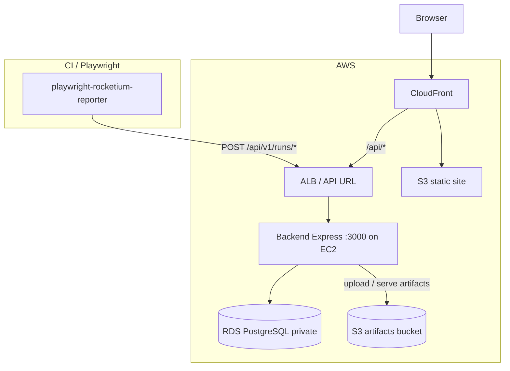
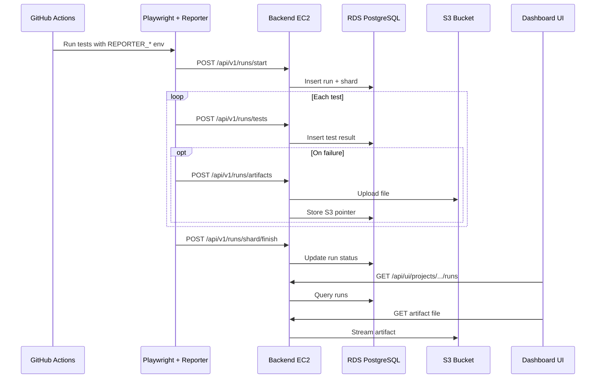
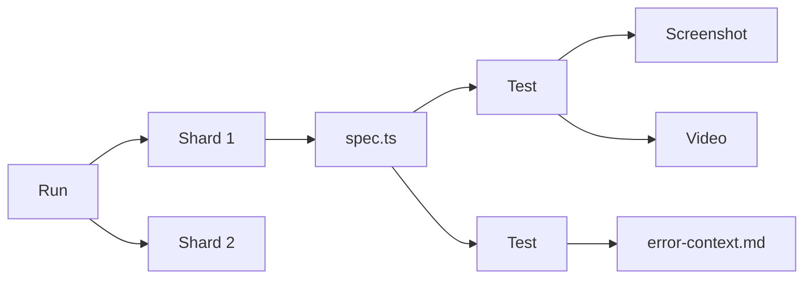
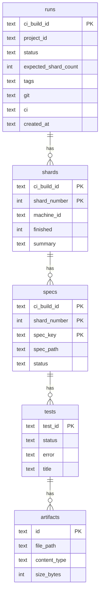
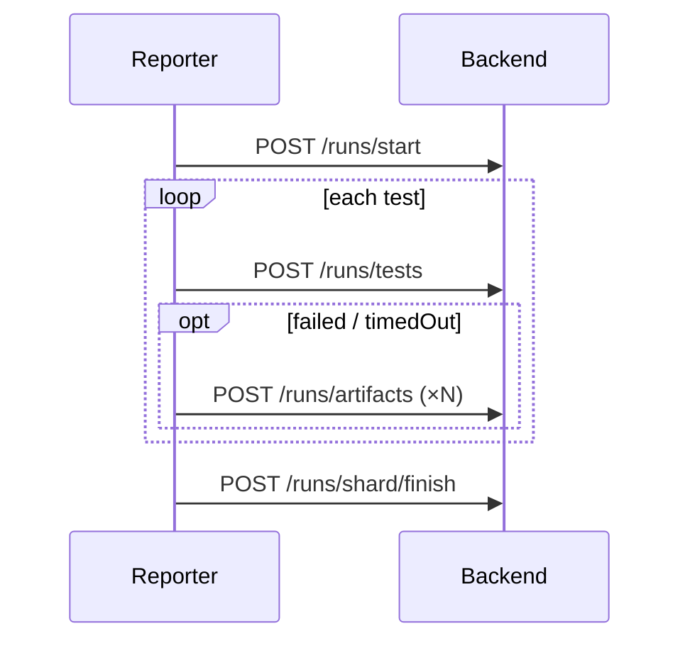

# Playwright Reporter Backend

HTTP API that receives test results from [`playwright-rocketium-reporter`](../rocketium-playwright-reporter) and stores them in a **Currents-style** hierarchy: **Run → Shards → Specs → Tests → Artifacts**.

Designed to replace Currents.dev for Rocketium E2E runs (staging sharding, CI, local dev).

---

## AWS deployment architecture

Production runs on AWS. Full step-by-step setup: [`docs/aws-deployment-guide.html`](docs/aws-deployment-guide.html).



### What each AWS service does

| Layer | Stores | Backend env var |
|-------|--------|-----------------|
| **RDS PostgreSQL** | Runs, shards, specs, tests, artifact pointers, users, projects | `DATABASE_URL` |
| **S3** | Screenshot / video / trace files | `ARTIFACT_STORAGE=s3`, `AWS_S3_BUCKET`, `AWS_REGION` |
| **EC2** | Runs Express API (no persistent files when using S3) | `PORT`, `JWT_SECRET` |
| **CloudFront + S3** | Built React UI (`dist/`) | None — static files only |

RDS and S3 work **together**: Postgres holds metadata; S3 holds binary artifacts.

### Production data flow (one CI shard)



### Deployment order

```text
1. RDS PostgreSQL     → save DATABASE_URL
2. S3 artifacts       → save bucket name + IAM role on EC2
3. EC2 backend        → .env + pnpm start (+ Nginx / ALB)
4. S3 + CloudFront UI → build dist/, upload, route /api/*
5. Dashboard          → create project, copy API key + project ID
6. GitHub secrets     → REPORTER_API_URL, REPORTER_API_KEY
7. CI workflow        → REPORTER_PROJECT_ID, shard vars
8. Verify             → /health + run workflow + check UI
```

### Data hierarchy (UI model)



| Level | Description | Example id |
|-------|-------------|------------|
| **Run** | One CI build / local run | `local-1780602020`, `github-12345` |
| **Shard** | Parallel machine / shard index | `shardNumber: 1..12` |
| **Spec** | One `.spec.ts` file in a shard | `e2e/.../importMedia.spec.ts` |
| **Test** | Single Playwright test case | Playwright `test.id` |
| **Artifact** | Screenshot, video, trace, etc. | `testId-screenshot-1738...` |

---

## Storage

Two layers: **metadata** (run tree) and **binaries** (files).

| Environment | Metadata | Artifacts |
|-------------|----------|-----------|
| **Production (AWS)** | RDS PostgreSQL | S3 bucket (`ARTIFACT_STORAGE=s3`) |
| **Local dev** | Docker Postgres (`pnpm db:up`) | `./uploads/` (`ARTIFACT_STORAGE=local` or unset) |

Run metadata is stored in **PostgreSQL**. Set `DATABASE_URL` or run `pnpm db:up` for local dev. JSON file storage is not supported.

**Binaries are never stored inside the DB.** The `artifacts` table only keeps `file_path`, `content_type`, `size_bytes`, and `name` (S3 key or local path). Max upload size: **200 MB** per file.

### Local artifact layout (`ARTIFACT_STORAGE=local`)

```
playwright-reporter-backend/
├── data/                    # Legacy JSON (unused)
└── uploads/
    └── local-123/
        └── <testId>/
            ├── 1738...-screenshot.png
            ├── 1738...-video.webm
            └── 1738...-error-context.md
```

### Production artifact layout (S3)

```
s3://<AWS_S3_BUCKET>/<AWS_S3_PREFIX>/
└── <ciBuildId>/
    └── <testId>/
        ├── screenshot.png
        ├── video.webm
        └── error-context.md
```

See also: [`docs/aws-s3-artifacts.html`](docs/aws-s3-artifacts.html).

---

## Database

Schema is created on startup (`CREATE TABLE IF NOT EXISTS`). See [`src/db/schema.ts`](src/db/schema.ts).



| Table | Purpose |
|-------|---------|
| `runs` | Build-level status, git/CI info, timing |
| `shards` | Per-shard summary when finished |
| `specs` | Aggregated status per spec file |
| `tests` | Each test result + error JSON |
| `artifacts` | Pointers to files under `uploads/` |

More detail: [`docs/DATABASE.md`](docs/DATABASE.md).

---

## API routes

Base URL: `http://localhost:3000` (configurable via `PORT`).

Reporter auth (required on `/api/v1`): per-project credentials from the UI — `Authorization: Bearer <project-api-key>` and `X-Project-Id: <projectId>`.

### Public

| Method | Path | Description |
|--------|------|-------------|
| `GET` | `/health` | Service health + storage hint |
| `GET` | `/uploads/*` | Static files (direct path access) |

### `/api/v1` (reporter writes + UI reads)

| Method | Path | Description |
|--------|------|-------------|
| `GET` | `/runs` | List runs (summary fields) |
| `GET` | `/runs/:ciBuildId` | Full run tree (shards, specs, tests, artifacts) |
| `POST` | `/runs/start` | Create or join run + register shard |
| `POST` | `/runs/tests` | Report one test end (pass/fail + error) |
| `POST` | `/runs/artifacts` | Upload file (`multipart/form-data`) |
| `GET` | `/artifacts/:artifactId/file` | Stream artifact (screenshot/video) |
| `POST` | `/runs/shard/finish` | Mark shard done + update run status |

### Request flow (one shard)



### Payload notes

**`POST /runs/start`** — `projectId`, `ciBuildId`, `shardNumber`, `expectedShardCount`, `machineId`, `git`, `ci`, `playwrightVersion`, `startedAt`.

**`POST /runs/tests`** — `ciBuildId`, `shardNumber`, `testId`, `specPath`, `title[]`, `status`, `durationMs`, `error` (nullable), timings, `retryIndex`.

**`POST /runs/artifacts`** — form fields: `ciBuildId`, `shardNumber`, `testId`, `specPath`, `name`, `contentType`, file field **`file`**.  
Test row must exist first (same order as reporter).

**`POST /runs/shard/finish`** — `ciBuildId`, `shardNumber`, `summary` (`passed`, `failed`, `skipped`, …).

Failure artifacts: [`docs/FAILURE_AND_ARTIFACTS.md`](docs/FAILURE_AND_ARTIFACTS.md).

---

## Quick start

### Requirements

- Node.js ≥ 20
- pnpm

### Install

```bash
pnpm install
cp .env.example .env
```

### Start the API

```bash
pnpm db:up          # Docker: postgres:16 on :5432
pnpm dev
```

### Wire automation tests

In `automation-tests-2.0/.env`:

```env
REPORTER_API_URL=http://localhost:3000
REPORTER_PROJECT_ID=9gEjLh
REPORTER_API_KEY=rptr_live_...   # from project settings in the UI
```

```bash
# automation-tests-2.0
pnpm test:local-shards
```

### Inspect a run

```bash
pnpm summary              # list runs from API
pnpm summary local-123    # print Run → Shards → Specs → Tests
```

---

## Scripts

| Command | Description |
|---------|-------------|
| `pnpm dev` | Start API with hot reload (`tsx watch`) |
| `pnpm build` | Compile TypeScript |
| `pnpm start` | Run compiled `dist/index.js` |
| `pnpm type-check` | TypeScript check |
| `pnpm summary [ciBuildId]` | CLI run tree ([`scripts/print-run-summary.js`](scripts/print-run-summary.js)) |
| `pnpm db:up` | `docker compose up -d` (Postgres) |
| `pnpm db:down` | Stop Postgres container |
| `pnpm db:logs` | Follow Postgres logs |

---

## Environment variables

| Variable | Default | Description |
|----------|---------|-------------|
| `PORT` | `3000` | HTTP port |
| `DATABASE_URL` | `postgresql://...@localhost:5432/rocketium_e2e_runs` | Postgres connection string |
| `DATABASE_SSL` | auto for RDS | Set `true` for RDS; `false` for local Docker |
| `ARTIFACT_STORAGE` | `local` | `s3` in production, `local` for dev |
| `AWS_REGION` | — | Required when `ARTIFACT_STORAGE=s3` |
| `AWS_S3_BUCKET` | — | S3 bucket for artifacts |
| `AWS_S3_PREFIX` | `artifacts` | Key prefix inside the bucket |
| `S3_ARTIFACT_URL_MODE` | `proxy` | `proxy` or `redirect` for artifact URLs |
| `JWT_SECRET` | — | Required for UI auth (`/api/ui/*`) |
| `JWT_EXPIRES_IN` | `7d` | JWT lifetime |
| `DATA_DIR` | `./data` | Legacy data directory |
| `UPLOADS_DIR` | `./uploads` | Local artifact root (when not using S3) |

Reporter clients use per-project `REPORTER_PROJECT_ID` + `REPORTER_API_KEY` (created in the UI — not a backend env var).

Full production reference: [`docs/aws-deployment-guide.html`](docs/aws-deployment-guide.html).

---

## Project layout

```
src/
├── index.ts              # Express app entry
├── routes/runs.ts        # API routes
├── auth.ts
└── db/
    ├── schema.ts         # SQL DDL
    ├── postgres-db-client.ts
    └── store/            # Data access layer (queries + mapping)
        ├── create.ts     # DB wiring
        ├── run-store.ts  # Reporter run CRUD
        ├── project-store.ts
        ├── run-query-store.ts
        ├── run-filter-store.ts
        └── analytics-store.ts
docs/
├── aws-deployment-guide.html
├── aws-s3-artifacts.html
├── DATABASE.md
└── FAILURE_AND_ARTIFACTS.md
```

---

## Related repos

| Repo | Role |
|------|------|
| [`rocketium-playwright-reporter`](../rocketium-playwright-reporter) | Playwright reporter package (sends events to this API) |
| [`playwright-reporter-ui`](../playwright-reporter-ui) | React dashboard (runs, projects, artifact viewer) |
| [`automation-tests-2.0`](../automation-tests-2.0) | E2E suite + `reporter.config.ts` + local shard runner |

---

## Roadmap

- [x] Web UI (run list, drill-down, artifact viewer)
- [x] S3-backed artifacts for CI / production
- [ ] Formal migrations (e.g. Drizzle / node-pg-migrate)
- [ ] Retention / cleanup jobs for old runs and files
