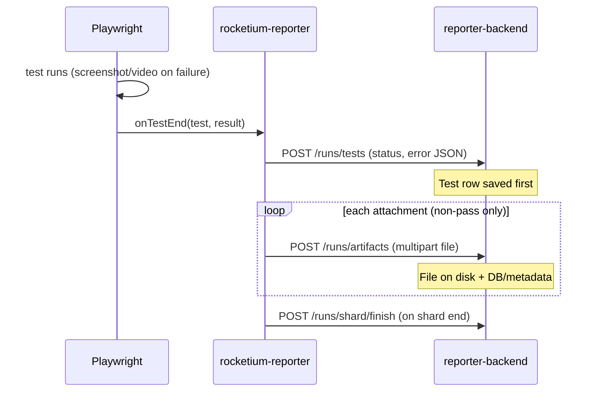

# Test failures: what gets stored

## Flow (one failing test)



## What Playwright attaches on failure

From `automation-tests-2.0/playwright.config.ts`:

| Attachment | When | Typical type |
|------------|------|----------------|
| Screenshot | `screenshot: "only-on-failure"` | `image/png` |
| Video | `video: { mode: "retain-on-failure" }` | `video/webm` |
| Error context | Playwright built-in | `text/markdown` (`error-context.md`) |
| Trace | if enabled | zip |

Passed tests **do not** upload artifacts (`uploadTestArtifacts` skips `status === "passed"`).

Statuses that upload: `failed`, `timedOut`, `interrupted`, `skipped` (skipped usually has no files).

## Reporter order (important)

1. `reportTest` — JSON: title, status, `error.message` / stack / snippet, timings
2. `uploadTestArtifacts` — one HTTP multipart per attachment with a path

If artifact upload runs before the test row exists, API returns **404 Test not found**.

## Backend storage

Run metadata is stored in **PostgreSQL** (default) or **SQLite**. Artifact binaries stay on disk:

- Metadata: `runs`, `shards`, `specs`, `tests`, `artifacts` tables
- Files: `uploads/{ciBuildId}/{testId}/{timestamp}-{name}`

### PostgreSQL (default)

```bash
pnpm db:up
pnpm dev
```

### Serving files

```
GET /api/v1/artifacts/{artifactId}/file
```

Also static: `/uploads/...` if you know the path.

## Enable / disable uploads

```bash
# default: on
REPORTER_UPLOAD_ARTIFACTS=false   # only send test JSON, no files
```

## Example failed test record

```json
{
  "testId": "abc123",
  "status": "failed",
  "error": {
    "message": "Timeout 30000ms exceeded...",
    "stack": "...",
    "snippet": "..."
  },
  "artifacts": [
    { "name": "screenshot", "contentType": "image/png", "filePath": "uploads/local-1/abc123/..." },
    { "name": "video", "contentType": "video/webm", "filePath": "uploads/local-1/abc123/..." },
    { "name": "error-context", "contentType": "text/markdown", "filePath": "..." }
  ]
}
```
